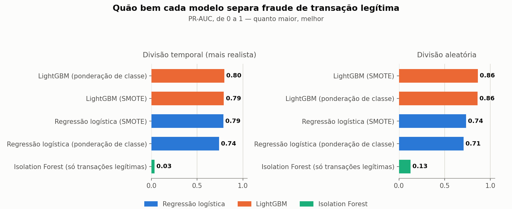
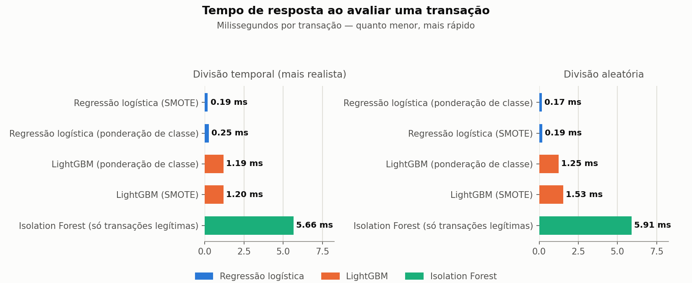

# fraud-detection-ML

[](https://github.com/OcimarSchroederJR/fraud-detection-ML/actions/workflows/tests.yml)

Detecção de fraude em transações de cartão de crédito, com engenharia de pipeline para dados extremamente desbalanceados.

## Sobre o projeto

Projeto acadêmico/pessoal de Machine Learning que usa o dataset público **Credit Card Fraud Detection** (ULB / Worldline, disponível no Kaggle), contendo 284.807 transações de cartões europeus realizadas ao longo de dois dias de setembro de 2013, das quais apenas 492 (≈0,172%) são fraudulentas.

O foco do projeto não é apenas treinar um classificador, mas explorar as decisões de engenharia exigidas por um problema de classe extremamente desbalanceada e por um cenário de inferência em tempo real:

- Comparação de estratégias de balanceamento (ponderação de classe, SMOTE, detecção de anomalia via Isolation Forest).
- Divisão temporal dos dados, além da divisão aleatória padrão.
- Métricas apropriadas para classes raras (PR-AUC, custo esperado por transação) em vez de acurácia.
- Medição de latência de inferência transação a transação.
- Serviço de inferência leve via FastAPI, empacotado com Docker.
- Interpretabilidade via SHAP.

## Resultados

Comparação real entre os 3 modelos e as 2 estratégias de balanceamento, nas divisões temporal e aleatória dos dados (números completos e discussão em [`docs/relatorio_final.md`](docs/relatorio_final.md)):





O Isolation Forest (detecção de anomalia, sem rótulos de fraude no treino) fica muito atrás dos modelos supervisionados em PR-AUC e é o mais lento dos três — evidência de que, neste dataset, fraude tem estrutura própria que a detecção de anomalia não-supervisionada não captura bem.

## Modelo treinado

Um modelo LightGBM já treinado (PR-AUC 0,81 na divisão temporal) vem versionado em [`models/model.joblib`](models/model.joblib), com as condições exatas do treino documentadas em [`models/model_metadata.json`](models/model_metadata.json) (hiperparâmetros, estratégia de balanceamento, divisão usada, métricas no teste, commit e versões das bibliotecas). Isso permite rodar a API e o dashboard sem precisar baixar o dataset nem treinar nada primeiro — só quem quiser reproduzir o treino ou testar outra estratégia precisa de `data/raw/creditcard.csv`.

## Dashboard interativo

Um dashboard em Streamlit permite testar o modelo já treinado com uma transação real (sorteada do dataset, se disponível) ou preenchida manualmente, além de visualizar a tabela de resultados acima interativamente:

```bash
streamlit run dashboard/app.py
```

## Estrutura do repositório

```
dashboard/        # dashboard interativo (Streamlit), separado do serving de produção
data/
  raw/            # dados brutos (não versionados)
  processed/      # dados processados (não versionados)
notebooks/        # notebooks de exploração
src/
  ingestion/      # carregamento e leitura dos dados
  preprocessing/  # limpeza e transformação
  balancing/      # estratégias de balanceamento de classes
  train/          # treino dos modelos
  evaluation/     # métricas e avaliação
  serving/        # código de inferência (API)
tests/            # testes automatizados, espelhando src/ e dashboard/
config/           # hiperparâmetros e caminhos
results/          # métricas e figuras geradas pelos scripts de avaliação
docs/             # guia do projeto, relatório final e discussões
```

## Fonte de dados

Dataset: [Credit Card Fraud Detection](https://www.kaggle.com/mlg-ulb/creditcardfraud) (ULB Machine Learning Group / Worldline), licença Database Contents License. Necessário apenas para retreinar o modelo ou rodar o notebook de análise exploratória — baixe o CSV e salve-o em `data/raw/creditcard.csv`.

## Como rodar

```bash
python -m venv .venv
source .venv/Scripts/activate  # Windows (Git Bash)
pip install -r requirements.txt

# testes automatizados
pytest

# retreina o modelo do zero (opcional — já vem um treinado em models/, requer data/raw/creditcard.csv)
python -m src.train.train_pipeline --model lightgbm

# matriz de comparação entre modelos e estratégias de balanceamento (passo 8)
python -m src.evaluation.run_comparison

# ranking de importância via SHAP (passo 14)
python -m src.evaluation.run_shap_report

# regenera as figuras de comparação usadas neste README
python -m src.evaluation.generate_report_charts

# serviço de inferência
uvicorn src.serving.api:app --reload

# dashboard interativo
streamlit run dashboard/app.py
```

## Status

- [x] Estrutura do projeto (Passo 4)
- [x] Validação de schema e divisão temporal/aleatória (Passos 7 e 13)
- [x] Estratégias de balanceamento: ponderação de classe e SMOTE (Passo 6)
- [x] Modelos: regressão logística, LightGBM e Isolation Forest (Passo 8)
- [x] Métricas para classes desbalanceadas: PR-AUC e custo esperado por transação (Passo 9)
- [x] Busca de hiperparâmetros com Optuna (Passo 10)
- [x] Medição de latência de inferência transação a transação (Passo 11)
- [x] Serviço de inferência (FastAPI) e empacotamento (Docker) (Passo 11)
- [x] Notebook de análise exploratória (Passo 5)
- [x] Interpretabilidade via SHAP (Passo 14)
- [x] Discussão de monitoramento e deriva de conceito, sem implementação completa (Passo 12) — [`docs/monitoramento_deriva_conceito.md`](docs/monitoramento_deriva_conceito.md)
- [x] Matriz de comparação entre modelos e estratégias de balanceamento sobre o dataset real (Passo 8) — [`results/comparacao_modelos.csv`](results/comparacao_modelos.csv)
- [x] Relatório final, com resultados reais preenchidos (Passo 16) — [`docs/relatorio_final.md`](docs/relatorio_final.md)
- [x] CI no GitHub Actions rodando a suíte de testes a cada push/PR
- [x] Dashboard interativo em Streamlit — [`dashboard/app.py`](dashboard/app.py)
- [x] Modelo treinado versionado com metadados de reprodutibilidade — [`models/model_metadata.json`](models/model_metadata.json)
